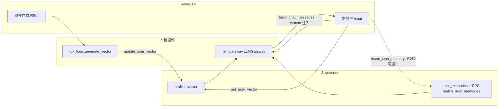

# HOKU315（JOT717）產品門面

依《開發憲法》見根目錄 **`DEVELOPMENT_CONSTITUTION.md`**；需求與狀態見 **`BACKLOG.md`**。

---

## 快速啟動指南

### 1. 取得程式與依賴

```powershell
cd c:\Users\juiyu\OneDrive\Desktop\HOKU315
python -m venv .venv
.\.venv\Scripts\Activate.ps1
pip install -U pip
pip install -r requirements.txt
```

> **說明**：`asyncio` 為 Python 標準庫，無需寫入 `requirements.txt`。

### 2. Supabase：建議 SQL 執行順序

| 順序 | 內容 | 說明 |
|------|------|------|
| 1 | **既有專案 schema** | 需具備 **`public.profiles`**（含 **`id`** uuid），以及與 `db_service` 對齊之 **`vector`**（或透過環境變數 `SUPABASE_PROFILES_VECTOR_COLUMN` 指定之欄位，預設 `vector`）。向量型別請與 **`pgvector`** / 專案 RPC 約定一致。 |
| 2 | **`get_safe_matches`**（或 `.env` 內 `SUPABASE_VECTOR_MATCH_RPC` 所設之 RPC） | 供相似向量查詢；`tests/test_db_connection.py` 會在具備憑證時驗證 RPC。 |
| 3 | **`sql/user_memories.sql`** | 建立 **`user_memories`** 表與 **`match_user_memories`** RPC，啟用 RAG Lite（對話記憶檢索）。執行前請確認 **`user_memories.user_id`** 外鍵可指向既有 **`profiles.id`**。 |
| 4 | **`sql/stories.sql`** | 建立 **Storage bucket `stories`**、**Storage RLS**（僅讀寫自己 `user_id/` 前綴）、**`public.stories`** 表與 RLS；物件路徑 `user_id/檔名`。 |

於 Supabase **SQL Editor**（具足夠權限之角色）依序貼上執行；新建表／函式後 PostgREST 可能短暫回 **`PGRST205`**，`db_service` 已內建重試與 **`ping_user_memories_table`** 暖機邏輯。

### 3. 環境變數（`.env`）

在專案根目錄建立 **`.env`**（勿提交版本庫；可複製範本後改寫）：

| 變數 | 必填 | 說明 |
|------|------|------|
| **`SUPABASE_URL`** | 雲端 E2E 必填 | Supabase 專案 URL（勿含尾隨 `/rest/v1` 亦可，`db_service` 會正規化）。 |
| **`SUPABASE_KEY`** | 雲端 E2E 必填 | 建議 **service_role** 或具讀寫 **`profiles` / `user_memories`** 之 anon＋RLS 策略（依部署而定）。 |
| **`SUPABASE_ANON_KEY`** | 建議（Task 6 RLS） | 公鑰 **anon**；`create_story`／`get_user_stories` 以 **使用者 JWT** 搭配 anon key 呼叫 PostgREST，RLS 才以登入者身份生效。未設時暫以 **`SUPABASE_KEY`** 代替（若為 service_role 可能繞過 RLS）。 |
| **`SUPABASE_ACCESS_TOKEN`** | 可選 E2E | 使用者 **access_token**；設定後可跑 **`python -m tests.test_story_auth`**、**`python -m tests.test_story_storage`**（實體上傳 **Storage `stories`** 並 list 驗證）。 |
| **`MOCK_LOGIN_USER_ID`** | 可選 | 本機無 JWT 時，作為 **`resolve_user_id`** 後備（遷移期；具 token 時忽略）。 |
| **`DB_TEST_PROFILE_ID`** | 測試建議 | 與 **`profiles`** 中已存在列一致之 **UUID**；`test_vector_persistence` 等；亦用作 **`resolve_user_id`** 最後後備。 |
| **`LLM_PROVIDER`** | 否 | `deepseek`（預設）或 `claude`；真實 HTTP 串接可於後續迭代擴充。 |
| **`SUPABASE_USER_MEMORIES_TABLE`** 等 | 否 | 僅在表／RPC 名稱與預設不同時覆寫，見 **`db_service.py`** 頂部常數。 |

**離線／無 API Key**：未設定 Supabase 時，多數測試以 **SKIP** 通過；一鍵跑全測見下方 **`python -m tests.run_all_tests`**。

### 4. 一鍵測試與啟動 UI

```powershell
cd c:\Users\juiyu\OneDrive\Desktop\HOKU315
python -m tests.run_all_tests
python -m reflex run
```

- 首頁：**`/`** 狐狸性向測驗（20 維滑桿 → **`update_user_vector`**）。  
- 對話室：**`/chat`**（**`build_chat_messages`** + RAG 提示 + 規則式 **`simulate_fox_ack`**）。

若 `reflex` 不在 PATH：`python -m reflex run`。編譯檢查：`python -m reflex compile`。

---

## 數據流示意圖



文字版：**測驗滑桿** → **`generate_vector`**（20 維）→ **`db_service.update_user_vector`** → **`profiles`**；**對話** → 讀取向量與（可選）**`match_user_memories`** → **`build_minefield_system_block`** 組裝 system → 送 LLM 或 **`simulate_fox_ack`** 回覆。

---

## 專案結構（精簡）

| 位置 | 說明 |
|------|------|
| 根目錄 | `db_service.py`、`fox_logic.py`、`llm_gateway.py`、`rxconfig.py`、憲法／Backlog、`.env`／依賴 |
| **`fox_quiz/`** | Reflex 應用（測驗 UI、`chat_component.py`） |
| **`sql/`** | Supabase 手動 DDL（如 **`user_memories.sql`**） |
| **`tests/`** | 單元／煙霧／可選 E2E；**`run_all_tests.py`** 一鍵總跑 |

---

## 依賴

見 **`requirements.txt`**（**`python-dotenv`**、**`supabase`**、**`reflex>=0.6.0`**）。升級 Reflex 後若編譯失敗，請對照官方 migration 調整 `rxconfig`／元件 API。
# HOKU315
